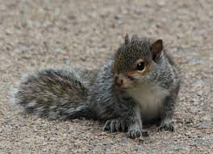

```{r setup, include=FALSE}
knitr::opts_chunk$set(collapse = TRUE, message = FALSE, 
  fig.width = 6,    
  fig.height = 4    
)
```

```{r}
library(tidyverse)
library(plotly)
library(sf)
```

#### Who are the Central Park squirrels? Here we report who they are and what they look like. 

```{r}
#First, we will import the cleaned squirrel data. 
squirrel_census = 
  read_csv("data/clean_squirrel_2018.csv")

central_park_map = st_read(here::here('central_park', 'CentralPark.shp'), quiet = TRUE)
```

In the 2018 census, there are `r nrow(squirrel_census)` unique squirrel sightings documented. As volunteer researchers observed the squirrels, they provided each squirrel with a unique identifier and documented the age and fur colors of each critter. 

<br><br> 

#### Let's first explore squirrel ages. 

:::: {style="display: flex;"}

::: {}

```{r, fig.width=6, fig.height=5}
squirrel_census |> 
  filter(age != "?") |> 
  ggplot() +
  geom_sf(data = central_park_map, color = "grey") +
  geom_point(
    aes(x = x, y = y, color = age),
    size = 0.5, alpha = 0.75) +
    theme_void(base_size = 15) +
  theme(legend.position = 'bottom') +
  guides(color = guide_legend(
    title.position = "top",
    override.aes = list(size = 3))) +
  scale_color_manual(values = c("Adult" = "aquamarine3", "Juvenile" = "slateblue")) +
  labs(title = "Squirrel Age",
       color = "Age")
```

:::

:::{}

```{r, fig.height=4, fig.width=4, fig.align='center'}
squirrel_census |> 
  filter(!(age %in% c("N/A", "?"))) |> 
  group_by(age) |> 
  count(age) |> 
  mutate(Age = fct_reorder(age, n)) |> 
  plot_ly (x = ~age, y = ~n, color = ~age,
         type = "bar") |> 
  layout(
    xaxis = list(title = "Age"),   
    yaxis = list(title = "Number of Squirrels") 
  )
```

:::

::::

It appears that the majority of observed squirrels are adults. There are 2503 adult squirrels in the data set and only 319 juvenile squirrels. 

<br><br> 

:::: {style="display: flex;"}

:::{}

```{r, echo=FALSE, out.width="100%", fig.align='center'}

```
<center style="font-size: 14px;"> Juvenile gray squirrel </center>
<br><br> 

:::

:::{}

```{r, echo=FALSE, out.width="100%", fig.align='center'}
knitr::include_graphics("./pictures/adult_squirrel.jpeg")
```
<center style="font-size: 14px;"> Adult cinnamon squirrel </center>

:::

::::

<br><br> 

#### Let's also look at primary and highlight fur color.

Some squirrels model only one fur color, but some extra fashionable squirrels will don mixed patterns of multiple fur colors. The primary fur color is the main color of the squirrel and the secondary colors accent the primary color to give some squirrels unique style. 

:::: {style="display: flex;"}

::: {}


```{r, fig.align='center', fig.width=5, fig.height=4}
ggplot() +
  geom_sf(data = central_park_map, color = "grey") +
  geom_point(
    data = squirrel_census,
    aes(x = x, y = y, color = primary_fur_color),
    size = 0.5, alpha = 0.75) +
    theme_void(base_size = 15) +
  theme(legend.position = 'bottom') +
  guides(color = guide_legend(
    title.position = "top",
    override.aes = list(size = 3))) +
  labs(color = 'Primary Fur Color',
       title = 'Squirrel Fur Color Distribution') +
  scale_color_manual(values = c("Black" = "black", "Gray" = "azure4", "Cinnamon" = "darkorange3")) 
```


```{r}
squirrel_census |> 
  filter(!(combination_of_primary_and_highlight_color %in% c("N/A", "?"))) |> 
  group_by(primary_fur_color) |> 
  count(primary_fur_color) |> 
  mutate(primary_fur_color = fct_reorder(primary_fur_color, n)) |> 
  plot_ly (x = ~primary_fur_color, y = ~n, color = ~primary_fur_color,
         type = "bar", colors = "viridis") |> 
  layout(
    xaxis = list(title = "Primary Fur Color"),   
    yaxis = list(title = "Number of Squirrels"), 
    legend = list(x = 0, y = 1, orientation = "h")
  )
```
:::

::: {}

```{r, fig.align='center', fig.width=6.5, fig.height=4}
squirrel_census |> 
  rename(combination_fur_color = combination_of_primary_and_highlight_color) |> 
  count(combination_fur_color) |> 
  mutate(combination_fur_color = fct_reorder(combination_fur_color, n)) |> 
  plot_ly (x = ~combination_fur_color, y = ~n, color = ~combination_fur_color,
         type = "bar", colors = "viridis") |> 
  layout(
    xaxis = list(title = "All Fur Colors",showticklabels = FALSE),   
    yaxis = list(title = "Number of Squirrels") 
  )
```
:::

::::

We can see that most squirrel in Central Park have Gray fur with some Cinnamon or White accents. Squirrels that are black with any accent colors are very rare! Consider yourself lucky if you've ever seen one of them frolicking in the park!


<br><br> 


#### Is there a difference in primary fur color depending on age? 

```{r}
squirrel_census |> 
  filter(!(age %in% c("N/A", "?"))) |>
  select(age, primary_fur_color) |> 
  group_by(age, primary_fur_color) |> 
  summarise(count = n()) |> 
  mutate(percent = count / sum(count) * 100) |> 
  plot_ly (x = ~age, y = ~percent, color = ~primary_fur_color,
         type = "bar", colors = "viridis") |> 
  layout(
    xaxis = list(title = "Age"),   
    yaxis = list(title = "Percent of Squirrels") 
  )
```

There does not appear to be any different in fur color by age. Among both the young and the old gray squirrels dominate the counts!

<br><br> 

<br><br> 
---
Photo credits: 
Juvenile squirrel: https://citywildlife.org/found-animal/baby-squirrels/
Adult Squirrel: https://www.onthewingphotography.com/ 
