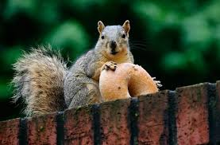

```{r setup, include = FALSE}
knitr::opts_chunk$set(collapse = TRUE, message = FALSE)
```

```{r, include = FALSE}
library(tidyverse)
library(plotly)
library(ggplot2)
library(sf)
library(dplyr)
library(patchwork)
library(leaflet)
library(modelr)
library(viridis)
```


Every squirrel in Central Park has a very busy schedule. Here, we describe the various activities and tasks squirrels do all over the park, and where those activities occur. Scroll down to learn more about where and when squirrels get their work done. 


```{r}
#Here we are loading in the data and a shapefile of Central Park!
squirrel_census = 
  read_csv("data/clean_squirrel_2018.csv")

central_park_map = st_read(here::here('central_park', 'CentralPark.shp'), quiet = TRUE)
```

<br><br>

### Snacky

#### Let's see where all the hungry squirrels are in Central Park!

Each green dot on the map below represents a squirrel that was spotted eating a snack. Zoom in to explore where squirrels dine in Central Park!
```{r, fig.width= 10, fig.align='center'}
squirrel_census |> 
  filter(eating == TRUE) |> view()
leaflet() |>  
  addTiles() |>  
  addCircleMarkers(data = squirrel_census,
             lng = ~x,
             lat = ~y,
             label = ~name,
             radius = 1,
             color = "green",
             stroke = TRUE, fillOpacity = 0.75,
             popup = ~paste("Name:", name,
                            "<br> Eating:", eating)) |> 
  addProviderTiles(providers$CartoDB.Positron)
```

There is not a lot of data about what the squirrels were eating when they were spotted, but here is a list of what some of the squirrels were eating:

* mushroom
* nut
* peanuts with shells
* red berries/berries
* osage orange
* bread

```{r}
library(rvest)

squirrel_census |> 
filter(str_detect(other_activities, "eating")) |> 
select(other_activities)
```

```{r, echo=FALSE, out.width= "40%", fig.align = 'center'}
knitr::include_graphics("./pictures/squirrel_w_nut.jpg")
```

<br><br>

### Sporty

#### If they aren't eating, they are doing some other activity...
```{r, fig.width= 10, fig.align='center'}
squirrel_census |> 
  mutate(
    activity = case_when(
      running == "TRUE" ~ "running",
      chasing == "TRUE" ~ "chasing",
      climbing == "TRUE" ~ "climbing",
      foraging == "TRUE" ~ "foraging",
      .default = "sedentary"
    )
  ) |> 
  filter(activity != "sedentary") |> 
  ggplot() +
    geom_sf(data = central_park_map, color = "grey") +
  geom_point(
    aes(x = x, y = y, color = activity),
    size = 0.5, alpha = 0.75) +
  scale_color_viridis_d() + 
    theme_void(base_size = 15) +
  theme(legend.position = 'None', 
        plot.title = element_text(size = 20))  +
  facet_grid(cols = vars(activity)) +
  guides(color = guide_legend(
    title.position = "top",
    override.aes = list(size = 20))
  )
```

The squirrels can be observed doing every type of squirrel activity all across the park. There are no bad places to go to watch squirrels chase each other, climb, forage, and run!

```{r, include=FALSE}
squirrel_census |> 
  mutate(
    activity = case_when(
      running == "TRUE" ~ "running",
      chasing == "TRUE" ~ "chasing",
      climbing == "TRUE" ~ "climbing",
      foraging == "TRUE" ~ "foraging",
      .default = "sedentary"
    )
  ) |> 
  filter(activity != "sedentary") |> 
leaflet() |>  
  addTiles() |>  
  addCircleMarkers(
             lng = ~x,
             lat = ~y,
             label = ~name,
             radius = 1,
             color = "coral",
             stroke = TRUE, fillOpacity = 0.75,
             popup = ~paste("Name:", name,
                            "<br> Activity:", activity)) |> 
  addProviderTiles(providers$CartoDB.Positron)
```

<br><br>

### Up high or down below? 

#### Where should one up high or down low to spot our furry friends?


```{r, fig.align='center'}
squirrel_census |> 
  ggplot() +
  geom_sf(data = central_park_map, color = "grey") +
  geom_point(
    aes(x = x, y = y, color = location),
    size = 0.5, alpha = 0.75) +
    theme_void(base_size = 15) +
  theme(legend.position = 'bottom') +
  scale_color_viridis_d() + 
  guides(color = guide_legend(
    title.position = "top",
    override.aes = list(size = 3))) +
  labs(
       color = "Location")
```

<br><br>

Our furry friends can most often be seen on the ground, as shown by the yellow points on the map (left). However, squirrels were also spotted in the trees all through the park!

<br><br>

<br><br>


### Day or night?


Is there a relationship between morning or afternoon sightings and the locations of the squirrels (ground plane, or above ground)?

<br><br>

###### State Hypotheses

* H0: There is no significant association between shift and location
* H1: There is a significant association between shift and location

<br><br>

###### Assumptions

The Chi-Square Test of Independence assumes that

1. Observations must be independent

2. Data must be categorical in nature

3. The expected frequency in each cell in the contingency table 
should be greater than 5

4. Data should be collected via random sampling

5. The overall sample size should be large 


We know assumptions 1, 2, 4, 5 and five are met. Let's double check 
the cell frequencies by generating a contingency table (below).

```{r}
#Create contingency table
contingency_table =
  squirrel_census |> 
  select(shift, location) |> 
  mutate_all(as.factor) |> 
  table()
```

```{r, out.width= 5}
knitr::kable(contingency_table, caption = " A 2x2 table of squirrels seen on or above ground at day or night.")
```

<br><br>

We can see from the contingency table that our cell counts for observed 
squirrels are well above the required frequency of 5. 

Let's continue on with our chi-square analysis!
```{r}
# Conduct Test
chi_square_result = chisq.test(contingency_table)
```

##### Conclusion

At the 0.05 level of significance, there is evidence to suggest that the distribution of locations is not independent of the shift;
in other words, **there is a significant association between the time of day and the location where squirrels are observed.**

This may mean that squirrels exhibit different location preferences or behaviors during the morning (AM) compared to the afternoon (PM). Squirrels are known to be diurnal animals, so the results of the chi-square test serves as additional evidence. Since squirrels have been observed to be active more during dawn and dusk, this makes a lot of sense. 

<br><br>

### What About a Logistic Regression Model?

We want to see if we can create a logistic regression model to predict the likelihood of a squirrel being observed on the "ground plane," based on time of squirrel sighting (`shift`) and the following behavioral variables: `running`, `chasing`, `climbing`, `eating` and `foraging`. 


```{r model}
# Fitting a Model

set.seed(1)

squirrel_census_df =
  squirrel_census|> 
  mutate_all(as.factor)

fit_logistic =
  squirrel_census |> 
  glm(location == "Ground Plane" ~ shift + running + chasing + climbing + eating + foraging, 
                    data = _, 
                    family = binomial())
```

 

```{r}
#Let's tidy up the output.

fit_logistic |> 
 broom::tidy() |> 
  mutate(OR = exp(estimate)) |> 
  select(term, estimate, OR, p.value) |> 
  knitr::kable()
```

Based on this output, we see that almost all of our results are statistically significant at the 5% level. A squirrel spotted on the ground plane is most likely to be seen running, climbing, eating, or foraging. The effect of chasing was not statistically significant at the 0.05 level. Squirrels spotted on the ground plane also have a likelihood to be spotted at night.

Let's look at some model diagnostics. 

```{r}
squirrel_census |> 
  modelr::add_predictions(fit_logistic) |> 
  mutate(fitted_prob = boot::inv.logit(pred))
```

:::: {style="display: flex;"}

:::{}

```{r, fig.height=4, fig.width=4}
squirrel_census |> 
  modelr::add_residuals(fit_logistic) |> 
  ggplot(aes(x = location, y = resid, fill= location)) +
  scale_fill_viridis_d() + 
  geom_violin() + 
  theme_bw() +
  theme(
    legend.position= "bottom"
  ) +
  labs(title = "Distribution of residuals")

```

:::

:::{}

```{r, fig.height=4, fig.width=4}
squirrel_census |> 
  modelr::add_predictions(fit_logistic) |> 
  modelr::add_residuals(fit_logistic) |> 
  ggplot(aes(x = pred, y = resid)) +
  geom_point(fill= "slateblue2") +
    labs(title = "Residuals vs. Fitted Values",
       x = "Fitted Values",
       y = "Residuals") +
  theme_bw()
```

:::

:::{}

```{r, fig.height=4, fig.width=4}
squirrel_census |> 
  modelr::add_residuals(fit_logistic) |> 
  ggplot(aes(sample = resid)) +
  stat_qq() +
  stat_qq_line() +
  theme_bw()+ 
  labs(title = "QQ plot of residuals")
```

:::

::::

From the QQPlot and our residuals plot, this model really isn't too awful. 


```{r, echo=FALSE, out.width= "40%", fig.align = 'center'}

```
<center style="font-size: 10px;"> Photo from:  https://www.6sqft.com/ </center>

