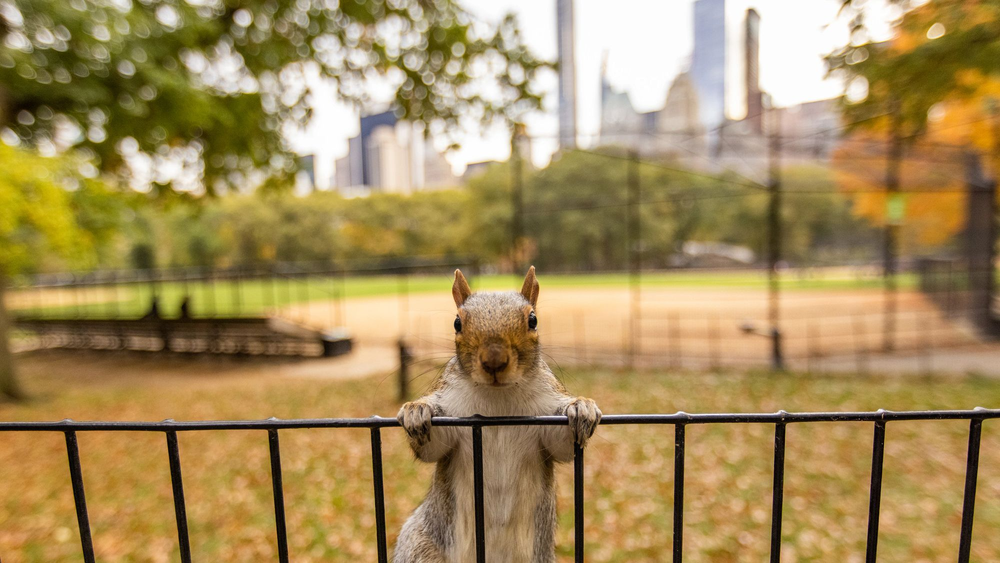

```{r, include = FALSE}
library(tidyverse)
library(ggplot2)
library(plotly)
```

```{r, include = FALSE}
squirrel_census = 
  read_csv("data/clean_squirrel_2018.csv")
```

---

```{r, echo=FALSE, out.width="60%", fig.align = 'center'}

```
<center style="font-size: 10px;"> Photo from:  https://www.centralparknyc.org/ </center>
     
<br><br>                                       

Squirrels are familiar neighbors to all New Yorkers. Central Park provides over 800 acres of prime habitat for approximately 2,300 squirrels. (That's roughly 2.74 squirrels per acre!)^1^

Our team hopes to close the divide between squirrels and New Yorkers by creating fun and engaging visual descriptions of Manhattan's fuzziest population. Explore our website to learn more about Central Park's squirrels using observational data from the 2018 Squirrel Census^2^. 


<br><br>


---

#### Link to screen cast 

---


### Meet the squirrels!

Hover over each point on the map to learn more about the name, age, and fur color of the squirrel spotted at that location!
```{r, fig.width= 8, fig.align='right'}
geo_coord = squirrel_census |> 
  mutate(
    activity = case_when(
      running == "TRUE" ~ "running",
      chasing == "TRUE" ~ "chasing",
      climbing == "TRUE" ~ "climbing",
      foraging == "TRUE" ~ "foraging",
      is.na(other_activities) ~ "sedentary") 
  ) |> select(x, y, name, age, primary_fur_color, activity)

map_squirrels = 
  geo_coord |> 
  mutate(squirrel_deets = str_c(name, age, primary_fur_color, activity, sep = "<br />")) |>
  plot_ly(
    lat = ~y,
    lon = ~x,
    color = ~primary_fur_color,
    colors = "Set2",
    marker = list(color = "Dark"),
    type = 'scattermapbox',
    hovertext = ~squirrel_deets,
    mode   = 'markers', 
    alpha = 0.7)

map_squirrels = 
  map_squirrels |> 
  layout(
    mapbox = list(
      style = 'carto-positron',
      zoom = 12.75,
      center = list(lon = -73.96473, lat = 40.78396))) 

map_squirrels 
```


---


For more informartion about New York's Squirrels, check out these references: 

1. https://www.centralparknyc.org/articles/getting-to-know-central-parks-squirrels
2. https://www.thesquirrelcensus.com/data


